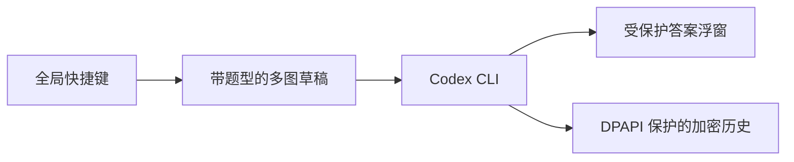

# 宝宝巴士

一个面向 Windows 10 2004+ / Windows 11 的键盘优先做题小助手。它把连续截取的主屏图片组织成同一题草稿，调用本机已登录的 Codex CLI，并把答案放进鼠标穿透的受保护浮窗。

> `WDA_EXCLUDEFROMCAPTURE` 只能请求 Windows 将浮窗排除在常见系统捕获 API 之外，不是 DRM。它无法防止相机、采集卡、远程桌面或特权录制程序；若 Windows 未确认保护状态，应用不会展示答案。

## 已实现的流程



首次按 `Ctrl+Alt+1`、`Ctrl+Alt+2` 或 `Ctrl+Alt+3` 分别创建通用、数学、代码草稿并截取主屏；重复按同一快捷键会把图按顺序追加到该题。`Ctrl+Alt+Enter` 提交，`Ctrl+Alt+Backspace` 清空，`Ctrl+Alt+H` 显隐答案。单题最多六张图，题型不能在同一草稿中混用。

内置题型带有不可被图片覆盖的基础安全提示。可以复制内置预设，修改副本的名称、任务模板和快捷键；自定义快捷键会保存到应用数据目录，并在下一次启动时生效。

## 本地运行

安装 Node.js、Rust stable（含 `rustfmt`）和 **Visual Studio 2022 C++ Build Tools 的 VCTools 工作负载** 后执行：

```powershell
npm install
npm run tauri dev
```

应用通过 `codex exec --ephemeral --json --sandbox read-only --image ...` 启动本机 Codex CLI，因此还需要先在终端完成 Codex 登录。截图、CLI 输出 Schema 和运行期文件置于应用数据目录；任务结束后删除运行期截图。

历史记录在本机 SQLite 索引与 AES-256-GCM 密文文件中保存，AES 主密钥由当前 Windows 用户的 DPAPI 保护。历史中的答案和图片保留 30 天后清理。

## 当前边界

手机端尚未开放网络监听，但 `ControlCommand` / `ControlEvent` / `ControlTransport` 已作为独立接口定义，后续可接入带二维码配对和 TLS 的局域网控制层，而不改变截图、任务或答案模型。

请仅在课程、练习或考试规则允许辅助工具的场景使用。
